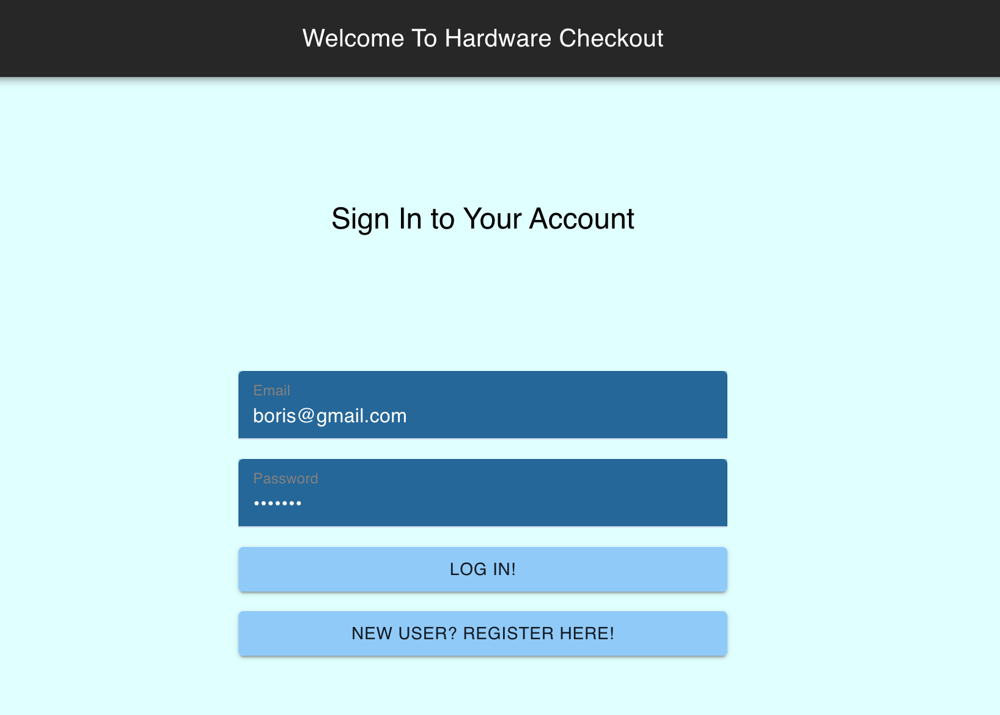
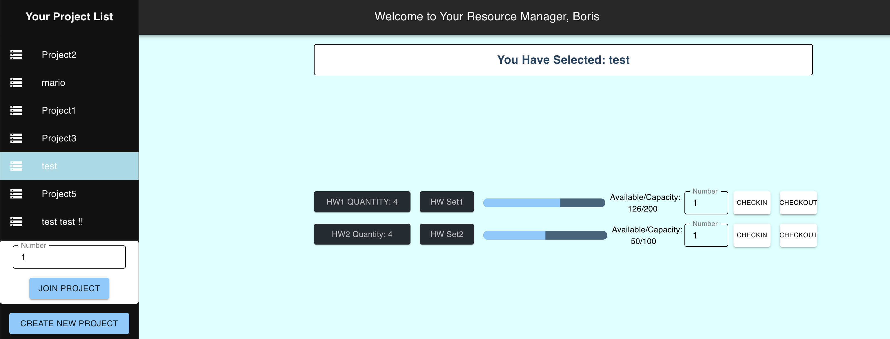

# EE461-Project-V2

## Overview
In this project, we focus on developing a Proof of Concept for a web application designed to function as a Hardware as a Service (HaaS) system. Our HaaS system develops a fully functional system that allows users to create and manage encrypted, secure accounts, join Team Projects, and check in and check out hardware for their projects! It abstracts out the organizational requirements for distributing Hardware Resources with a clean, easy-to-use, extensible interface.



## Prerequisites
* [Python](https://www.python.org/downloads/)
* [node.js](https://nodejs.org/en)

## Starting the Backend
```
cd backend
python -m venv venv 
source venv/Scripts/activate
pip install -r requirements.txt --user
python app.py
```

## Starting the Frontend
```
cd frontend
npm install 
npm start
```
